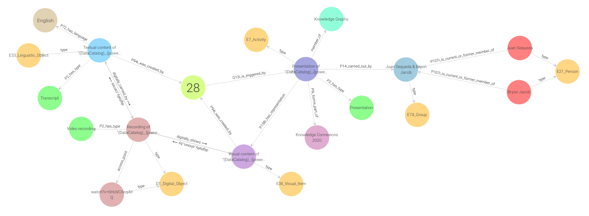

# Connected Data Knowledge Graph Challenge: Linked Art

A [Linked Art](https://linked.art/) knowledge graph for the [Connected Data Knowledge Graph Challenge](https://github.com/Connected-Data/cdkg-challenge).



## Data

Representations of each resource are partitioned according to the [Linked Art API](https://linked.art/api/1.0/).

| Class                                                  | Category                       |
|-                                                       |-                               |
| [Activity](data/domain/base/Activity/)                 | Presentation events            |
| [DigitalObject](data/domain/base/DigitalObject/)       | Video recordings               |
| [Event](data/domain/base/Event)                        | Conference events              |
| [Group](data/domain/base/Group/)                       | Groups of speakers             |
| [LinguisticObject](data/domain/base/LinguisticObject/) | Presentation and podcast texts |
| [Person](data/domain/base/Person/)                     | Speakers                       |
| [Set](data/domain/base/Set)                            | Conference tracks              |
| [VisualItem](data/domain/base/VisualItem/)             | Presentation imagery           |

An aggregation of all the representations is available at [cdkg.ttl](data/domain/base/cdkg.ttl)

## Code

### CLI

Generate the Linked Art representations.

```bash
# Set up a development environment
python3 -m venv .venv
source .venv/bin/activate

# Clone and install the package
git clone ...
pip install -e cdkg

# Generate the representations
python cdkg/cli/cli.py --base https://example.org/cdkg/
```

### Module

```python
from cromulent.model import factory
from cdkg.representation import base


for resource in base.ACTIVITY:
    print(factory.toString(resource, compact=False))
```

Enrichments to the catalogue may extend [`cdkg.representation.extra.enrichment`](cdkg/representation/extra/enrichment.py)
